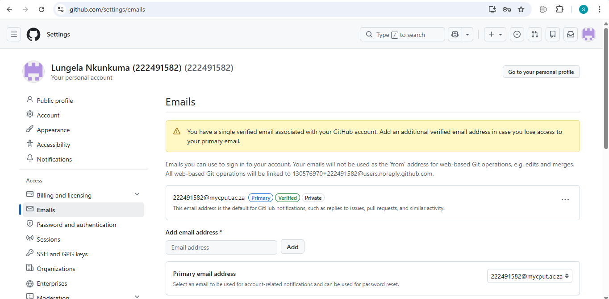

# 222491582.github.io

# Lungela-Nkunkuma-222491582 CV

## Location
Cape Town, South Africa  

## Contact
Phone: +27 74 288 4834  
Email: 222491582@mycput.ac.za

---

## About Me
I am a hardworking and passionate individual with a strong interest in technology. I have programming experience and enjoy problem-solving and building practical solutions.
I have strong communication skills, work well in a team, and I am always eager to learn and explore new technologies.
I am open to on-site, hybrid, or remote opportunities.

---

## Education

Cape Peninsula University of Technology (CPUT)  
Diploma in Information and Communication Technology: Applications Development
Current Student  

Hoërskool Uitsig  
Pretoria, Gauteng — 2021  

---

## Technical Skills

### Programming Languages
- Java  
- Python  
- JavaScript  

### Web Technologies
- HTML  
- CSS  

### Database
- SQL  

### Frameworks / Platforms
- Android  
- UiPath (RPA)  

### Tools & IDEs
- Visual Studio Code  
- IntelliJ IDEA  
- Git  

---

## Experience

FirTech (Pty) Ltd — RPA Developer (Vacation Work)  
Sandton, Gauteng — 2026  

- Shadowed RPA developers while completing the RPA Associate learning pathway  
- Built automation workflows using UiPath Studio  
- Used UiPath Orchestrator to deploy and monitor processes  
- Gained understanding of RPA architecture and lifecycle  
- Debugged and tested automation solutions  
- Worked within the UiPath ecosystem  

---

McDonald's South Africa — Technical Support (Vacation Work)  
Sandton, Gauteng — 2025  

- Provided first-line IT support and troubleshooting  
- Assisted with system monitoring and user access management  
- Collaborated with IT specialists  
- Set up devices and installed software  
- Helped onboard new employees with technical systems  
- Managed help desk support tasks:
  - Ticket handling and escalation  
  - User support  
  - Account management  

## References

Paul Williams  
IT Consultant, McDonald's South Africa  
Phone: 011 236 2432  
Location: 85 Greyston Drive, Sandton  

---

Ronald McDonald House Charities — Volunteer  
Johannesburg — 2020  

- Assisted families with sick children  
- Provided kitchen and cleaning support  
- Helped reduce stress for families  
- Assisted with admin and meal preparation  

---

## Projects

Book E-Commerce Web Application  
CPUT Project — 2025  

Technologies: Java, MySQL, HTML, CSS, JavaScript, JSON  

- Built a full-stack book buying/selling platform  
- Implemented user registration and login  
- Designed database for users and transactions  
- Applied OOP and multi-layer architecture  
- Created a clean UI using HTML/CSS/JS  

---

Car Repair Shop Management System  
CPUT Project — 2025  

Technologies: React, Java, MySQL, JSON  

- Built frontend using React  
- Developed backend logic in Java  
- Implemented CRUD operations  
- Integrated database with MySQL  
- Designed user-friendly navigation  

---

## GitHub Student Account Evidence

The screenshot below confirms that my GitHub account is registered using my student email address.

## Reflection on Coding in Markdown

### Situation
As part of this portfolio project, I needed to create and present my CV in Markdown format on GitHub.

### Task
My task was to learn the basics of Markdown syntax and use it to organise my CV into a professional digital format that could be displayed online.

### Action
I researched how Markdown formatting works and used headings, bullet points, sections, and formatting syntax to structure my CV clearly. I organised the information into sections such as education, technical skills, work experience, and projects.

### Result
I successfully created a clean and professional CV in Markdown format. This helped me strengthened my understanding of Markdown and showed me how simple formatting tools can be used to present professional information effectively online.

## Reflection on Mock Interview Video

### Situation
For this project, I was required to create and embed a mock interview video into my digital portfolio.

### Task
My task was to prepare for a mock interview, present myself professionally, and successfully upload the video to my portfolio.

### Action
I prepared responses to common interview questions, practised speaking clearly and confidently, and recorded the video. After recording, I uploaded the video and linked it within my GitHub portfolio so that it could be accessed as part of the submission.

### Result
This activity improved my confidence in presenting myself professionally and taught me how multimedia elements can be integrated into an online portfolio. It also helped me improve my communication and self-presentation skills.

## Reflection on the Use of GitHub Pages

### Situation
As part of building my digital portfolio, I needed to publish my work online using GitHub Pages.

### Task
My task was to configure GitHub Pages correctly so that my portfolio could be hosted and accessed through a public web link.

### Action
I created the repository, uploaded my portfolio files, enabled GitHub Pages in the repository settings, and tested the published site to ensure it displayed correctly.

### Result
I successfully published my digital portfolio online and gained practical experience using GitHub Pages for web hosting. This improved my understanding of how development tools can be used to deploy and share professional work online.
